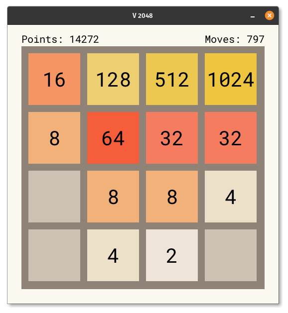

# V 2048

This is a simple 2048 game, written in [the V programming language](https://vlang.io/).

WebAssembly demo: https://v2048.vercel.app



## Description

Merge tiles by moving them.
After each move, a new random tile is added (2 or 4).
The goal of the game is to create a tile with a value of 2048.

## Keys

Escape - exit the game
Backspace - undo last move
n - restart the game
t - toggle the UI theme
Enter - toggle the tile text format

UP,LEFT,DOWN,RIGHT / W,A,S,D / touchscreen swipes - move the tiles

## Running instructions

Compile & run the game with `./v run examples/2048`

## Compiling to WASM

1. Install Emscripten from:
   https://emscripten.org/docs/getting_started/downloads.html

2. Make sure that the environment in your shell is setup correctly,
   i.e. that `emcc --version` works.

   ```sh
   . /opt/emsdk/emsdk_env.sh
   emcc --version
   ```

3. Compile the game to WASM:
   (the JS file contains a loader for the .wasm file, without the extension):
   ```sh
   v -prod -os wasm32_emscripten -o examples/2048/index.js examples/2048/
   ```

5. Run/test the game:

   ```sh
   emrun examples/2048/index.html
   ```
   
   If you prefer, instead of `emrun`, you can start a simple V http file server:
   ```sh
   v -e 'import net.http.file; file.serve(folder: "examples/2048")'   
   ```
   and then open http://127.0.0.1:4001/ in your browser.

Once you have opened the game in your browser, you can make changes to
the V source, then recompile (step 3), and refresh the browser window
with the game, to see their effect.
