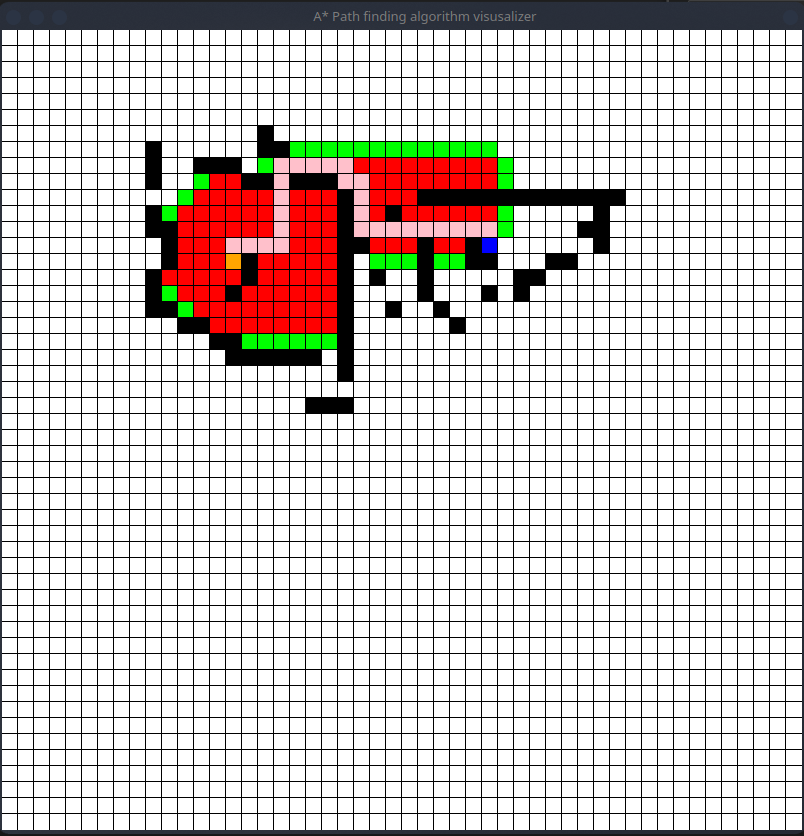

# A* path finding algorithm visualizer
This is a simple visualizer for an A* path finding algorithm written in V.

# Quick start 

```console
# to run:
$ v run aStar.v

# to just compile:
$ v aStar.v

# then to run:
$ ./aStar
```

# Controls

- `q` : To quit the application
- `c`: clear the grid and start from new one 
- `space`: initialize path finding algorithm 


# Demo 


# 🔴🔴🔴🔴 Area of improvements 🔴🔴🔴🔴🔴

- 🚧 Under Construction: We are using heap, but that is not correctly
implemented, since instead of O(log(n)) it takes O(n). For that reason,
having a bigger grid size, will break the application.

- 🌱 Growth Opportunity: make it responsive.
