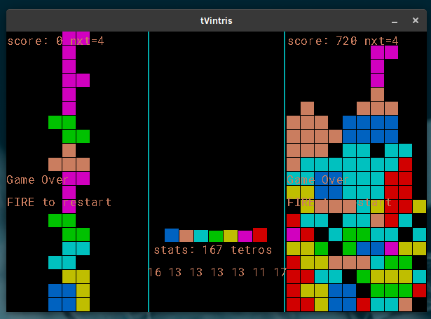

# tVintris

tvintris.v is a dual-player (local) version based on original source from <a href='https://github.com/vlang/v/examples/tetris'>tetris example</a> by Alex M.
It is largely inspired by ancient game Twintris.
-uses vlib sdl module

# how to run tVintris

`$ v run .`

# Credits

Colors, Music and Sounds inspired/ripped from amiga title Twintris (1990 nostalgia !)
- Graphician : Svein Berge
- Musician : Tor Bernhard Gausen (Walkman/Cryptoburners)
