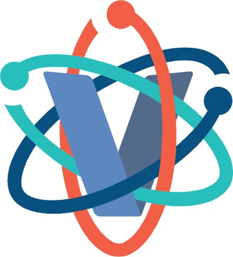

 

# V Scientific Library v0.2

A pure-V scientific library with a great variety of functions.

> The version of this module will remain in `0.x.x` unless the language API's are finalized and implemented.

## Docs

Visit [vsl docs](https://vsl.readthedocs.io/en/stable/) to know more about the supported features on VSL **v0.2**.

## Contributing

PLEASE DO NOT MODIFY THE FILES OF THIS MODULE. If you find potencial errors 
or want to add new features, create an issue or make a pull request
in the [official VSL repository](https://github.com/ulises-jeremias/vsl).

## License

[MIT](LICENSE)

MIT License

Copyright (c) 2019-2020 Ulises Jeremias Cornejo Fandos

Permission is hereby granted, free of charge, to any person obtaining a copy
of this software and associated documentation files (the "Software"), to deal
in the Software without restriction, including without limitation the rights
to use, copy, modify, merge, publish, distribute, sublicense, and/or sell
copies of the Software, and to permit persons to whom the Software is
furnished to do so, subject to the following conditions:

The above copyright notice and this permission notice shall be included in all
copies or substantial portions of the Software.

THE SOFTWARE IS PROVIDED "AS IS", WITHOUT WARRANTY OF ANY KIND, EXPRESS OR
IMPLIED, INCLUDING BUT NOT LIMITED TO THE WARRANTIES OF MERCHANTABILITY,
FITNESS FOR A PARTICULAR PURPOSE AND NONINFRINGEMENT. IN NO EVENT SHALL THE
AUTHORS OR COPYRIGHT HOLDERS BE LIABLE FOR ANY CLAIM, DAMAGES OR OTHER
LIABILITY, WHETHER IN AN ACTION OF CONTRACT, TORT OR OTHERWISE, ARISING FROM,
OUT OF OR IN CONNECTION WITH THE SOFTWARE OR THE USE OR OTHER DEALINGS IN THE
SOFTWARE.

## Contributors

- [Ulises Jeremias Cornejo Fandos](https://github.com/ulises-jeremias) - creator and maintainer
